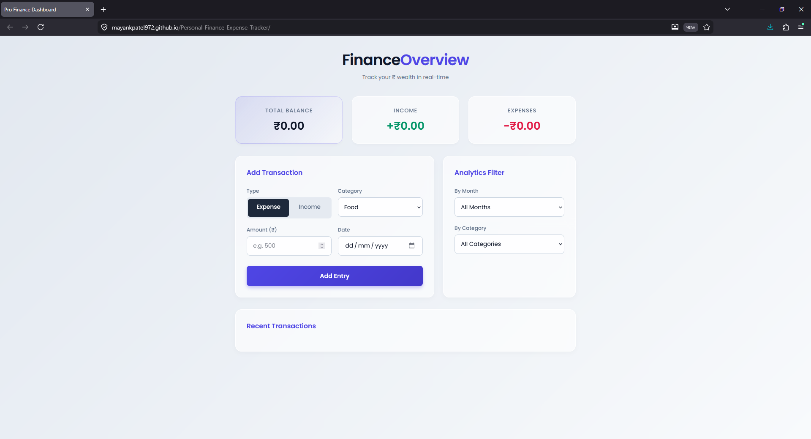

# Pro Finance Dashboard 💰

**[🔴 Live Demo: Click Here to View the Dashboard]([https://yourusername.github.io/your-repo-name](https://mayankpatel972.github.io/Personal-Finance-Expense-Tracker/))**



> A modern, client-side personal finance tracker built to demonstrate real-time DOM manipulation, state management, and modern CSS design principles. 

This project allows users to seamlessly track their income and expenses, automatically calculates their net balance, and provides powerful filtering tools—all handled natively in the browser without the need for a backend.

## ✨ Features

* **Real-Time Calculations:** Automatically updates Total Balance, Income, and Expenses as transactions are added or removed.
* **Dynamic Form Logic:** Features a "Cascading Select" dropdown; categories automatically update based on whether the user toggles "Income" or "Expense".
* **Advanced Analytics Filter:** Users can filter their transaction history by specific months or categories in real-time.
* **Persistent Data Management:** Utilizes the browser's native `localStorage` API to save data. Refreshing or closing the browser won't delete the user's financial records.
* **Modern UI/UX:** Built with a clean "Light Glassmorphism" theme, featuring blurred backgrounds, responsive CSS grid layouts, and smooth hover state animations.

## 🛠️ Tech Stack

* **HTML5:** Semantic structure and accessible forms.
* **CSS3:** Custom variables, CSS Grid/Flexbox, `backdrop-filter` for glassmorphism, and responsive design.
* **Vanilla JavaScript (ES6+):** Array methods (`.filter()`, `.reduce()`, `.map()`), event listeners, DOM traversal, and JSON serialization.

## 🚀 How to Run Locally

Because this project uses vanilla web technologies and client-side storage, no complex build tools or Node.js installations are required.

1. Clone this repository to your local machine:
   ```bash
   git clone [https://github.com/MayankPatel972/Personal-Finance-Expense-Tracker.git](https://github.com/MayankPatel972/Personal-Finance-Expense-Tracker.git)
